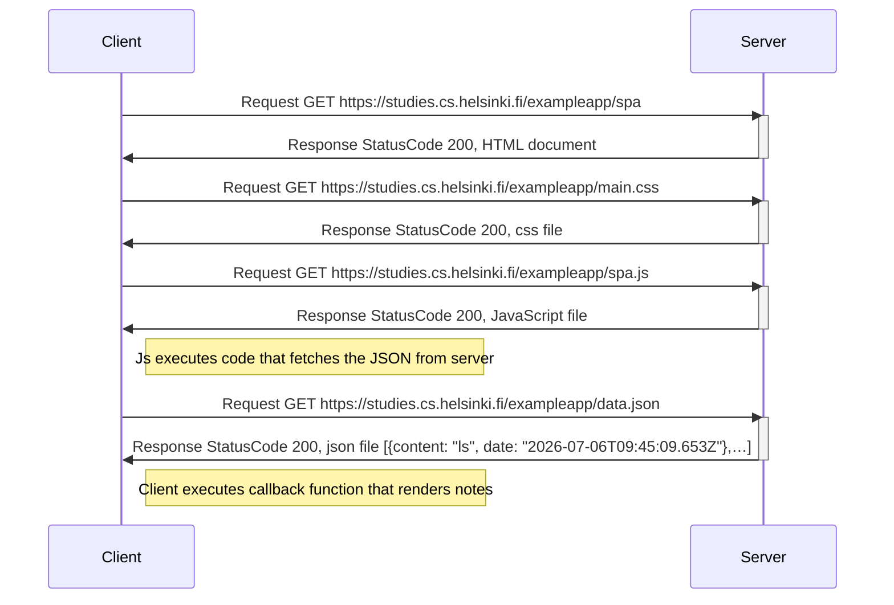

```mermaid
sequenceDiagram
    Client->>Server: Request GET https://studies.cs.helsinki.fi/exampleapp/spa
    activate Server
    Server->>Client: Response StatusCode 200, HTML document
    deactivate Server

    Client->>Server: Request GET https://studies.cs.helsinki.fi/exampleapp/main.css
    activate Server
    Server->>Client: Response StatusCode 200, css file
    deactivate Server

    Client->>Server: Request GET https://studies.cs.helsinki.fi/exampleapp/spa.js
    activate Server
    Server->>Client: Response StatusCode 200, JavaScript file
    deactivate Server

    Note right of Client: Js executes code that fetches the JSON from server

    Client->>Server: Request GET https://studies.cs.helsinki.fi/exampleapp/data.json
    activate Server
    Server->>Client: Response StatusCode 200, json file [{content: "ls", date: "2026-07-06T09:45:09.653Z"},…]
    deactivate Server

    Note right of Client: Client executes callback function that renders notes

```
