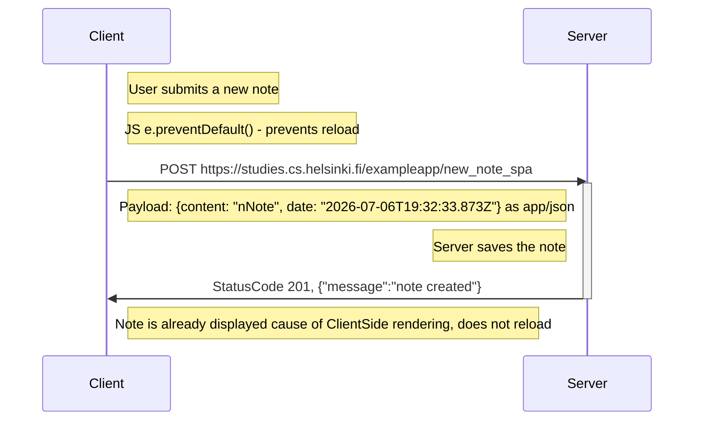

```mermaid
sequenceDiagram
  participant Client
  participant Server

  Note right of Client: User submits a new note

  Note right of Client: JS e.preventDefault() - prevents reload
  Client->>Server: POST https://studies.cs.helsinki.fi/exampleapp/new_note_spa
  activate Server
  Note left of Server: Payload: {content: "nNote", date: "2026-07-06T19:32:33.873Z"} as app/json
  Note left of Server: Server saves the note
  Server->>Client: StatusCode 201, {"message":"note created"}
  deactivate Server

  Note right of Client: Note is already displayed cause of ClientSide rendering, does not reload
```
